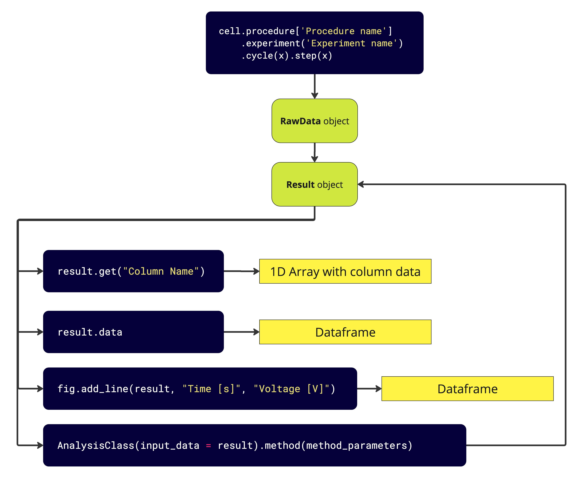

Introduction
============

PyProBE is a Python package designed to simplify the process of analysing data from 
battery cyclers. It has four core objectives:

1. Ease of use
    PyProBE is written in Python, a commonly used programming language in the battery
    community. However, it has been designed to be approachable for those with little 
    programming experience. 

    PyProBE breaks down complex battery data into simple, easy to understand objects 
    that can be accessed with a few lines of code using natural language. The 
    procedure shown below:

    .. image:: images/Procedures_and_experiments.jpg

   can be filtered with simple commands like:

    .. code-block:: python

        # Filter the data to only include the charge pulses
        cell.procedure['RPT'].experiment('Charge Pulses')

        # Filter to only the charge step of the third pulse
        cell.procedure['RPT'].experiment('Charge Pulses').cycle(2).charge(0)

   This makes it easy to quickly access the data you need for analysis.

   See the :doc:`filtering data <../examples/filtering-data>` example to see this in action.

2. Accelerate battery data exploration
    PyProBE has a built-in :ref:`plotting <plotting>` module for fast and flexible 
    visualisation of battery data. It also includes a graphical user interface (GUI) 
    for exploring data interactively, with almost no code. See the 
    :doc:`getting started <../examples/getting-started>` example to try the GUI.

3. Encourage data processing aligned with FAIR principles
    PyProBE is designed to encourage good practice for storing and processing data. The 
    FAIR principles. PyProBE requires a README file to sit alongside your experimental 
    data which is:

    Computer readable
      Simplifies the PyProBE backend, maximises flexibility to different input data and
      makes the setup setup process fast and intuitive for new data.

    Human readable
      Sits alongside your data to allow others to quickly understand your experimental
      procedure.

   See the :ref:`guidance <writing_a_readme_file>` for writing README files for your
   experiments.

4. Host a library of post processing methods
    PyProBE's :mod:`~pyprobe.analysis` module contains classes and methods to
    perform further analysis of battery data. It is designed to maintain compatibility 
    with the PyProBE data format and plotting tools while ensuring functions are simply 
    defined, portable and tested.

    It is easy to contribute to the analysis module. See the :ref:`guidance <contributing_to_the_analysis_module>`
    and `contributing guidelines <https://github.com/ImperialCollegeLondon/PyProBE/blob/main/CONTRIBUTING.md>`_.

PyProBE Structure
-----------------
Below is a flowchart of how a PyProBE :class:`~pyprobe.cell.Cell` object is structured
and how the stored data can be filtered:

.. image:: images/Filtering_flowchart.jpg

All data is stored in a :class:`~pyprobe.cell.Cell` object, which contains an
:attr:`~pyprobe.cell.Cell.info` attribute for storing metadata and a 
:attr:`~pyprobe.cell.Cell.procedure` dictionary for storing data for the experimental
procedures run on the cell. These can be further filtered as described in the 
:ref:`filtering` section of the user guide.

Once the data is filtered, it can be processed further with a 
method in the :mod:`~pyprobe.analysis` module or displayed using the built-in 
:mod:`~pyprobe.plot` module. All filters produce objects that are compatible with the 
plotting module, making it easy to visualise the data at any stage of the analysis. Additionally, 
all methods in the analysis module produce a :class:`~pyprobe.result.Result` which can 
be an input to further methods. This is summarised in the flowchart below:

This documentation
------------------
These docs are generated from the continuous development branch (main) of the PyProBE
repository. If you are using a particular release of PyProBE, you can generate the docs
specific to your release locally by running the following commands:

.. code-block:: bash

    cd PyProBE/docs
    make html

Then navigate to :code:`PyProBE/docs/build/html/` and open :code:`index.html` in your
web browser.

.. footbibliography::