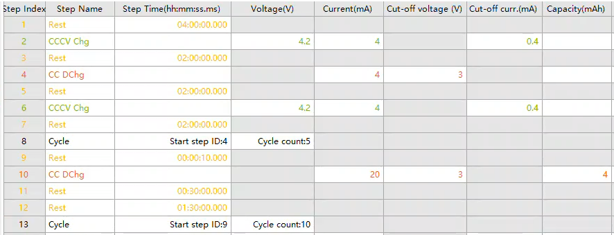

.. _writing_a_readme_file:

Writing a README file
=====================

The PyProBE README format
-------------------------

The PyProBE README format is a legacy way to describe the instructions a battery
cycler ran, so that a procedure can be filtered into experiments and cycles
afterwards. A protocol tree, held in ``metadata.battinfo_test_protocol.method``,
replaces it for a source that already carries one.

A README describes a procedure as a :code:`.yaml` file. It converts to a protocol
tree on an explicit call, through
:meth:`~pyprobe.filters.Procedure.attach_legacy_readme`:

.. code-block:: python

   from pyprobe.filters import Procedure

   procedure = Procedure.load("path/to/cycler_file.csv")
   procedure.attach_legacy_readme("path/to/README.yaml")

The call replaces the current protocol of *procedure* with the tree the README
converts to.

The :code:`README.yaml` contains the following information:

* The name of the experiment
   This enables filtering by :code:`'Experiment Name'` with the

   :code:`procedure.experiment('Experiment Name')`

   syntax.

* Steps
   This is a list of strings that describe each step of the experiment. The strings
   should follow `PyBaMM's Experiment string <https://docs.pybamm.org/en/stable/source/api/experiment/experiment_steps.html#pybamm.step.string>`_
   syntax. There are some instances when two PyBaMM experiment strings must be included
   in the same step. An example is a CC-CV hold, if the cycler allows you to define
   this in a single step. In this instance the step description can be written as two
   PyBaMM Experiment strings separated by a comma, one for the CC part and one for the
   CV part.

   Each step should be given a step number. These numbers should increase in line with the real step numbers
   defined by the cycler, i.e. Neware cyclers treat a `repeat` instruction as its own
   step. Therefore, where there is a repeat instruction in the cycler procedure, the
   corresponding step number should be skipped.

* Cycle:
   This is a section that provides details on repeats of the provided steps. PyProBE
   looks for any title containing the string :code:`"cycle"`, so you can choose any name that
   includes this or add multiple cycles with different names.

   Cycle details must include the keywords "Start", "End" and "Count". These identify
   the first and last steps of the cycle (inclusive) and the number of times it is
   repeated. The steps a cycle bounds must form a contiguous group of that
   experiment's steps. A cycle that cuts across the step list raises a
   :class:`ValueError` that names the experiment and the cycle key.

   Within a single experiment there is no limit on the number of cycles you can define.
   If cycles are nested, the outer cycle must be listed *before* the inner cycle.

The following is an example of a :code:`README.yaml` file:

.. literalinclude:: ../../../tests/sample_data/neware/README.yaml
    :language: yaml

Which corresponds to the following Neware procedure file:

The YAML format
---------------
The `YAML` format is a readable, structured format for data serialization. To identify
formatting errors, the `YAML VSCode extension <https://marketplace.visualstudio.com/items?itemName=redhat.vscode-yaml>`_
is highly recommended.

Shortcuts
---------
For most experiments, writing a README file should not be too time consuming and
provides value by documenting your data in a human readable format.

For testing purposes or if an experiment is particularly cumbersome to write out, you
can replace the :code:`Steps` list with :code:`Total Steps`, allowing you to provide
just a single number for the total number of steps in the experiment:

.. code-block:: yaml

   # This is the name of the experiment
   Break-in Cycles:
      # The total number of steps in the experiment
      Total Steps: 5

The total steps must include any cycle instruction steps. This is why 5 is provided in
the example above, as `Break-in Cycles` contains 4 listed steps and a cycling step.

.. footbibliography::
