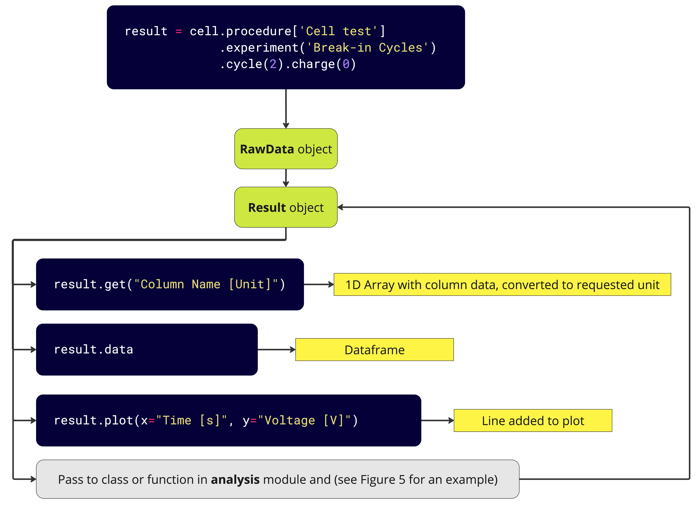

# Summary
`PyProBE` (Python Processing for Battery Experiments) is a Python package to process experimental data in a standardised and reproducible way. Recognising that battery experiments are often derivatives of standard procedures, `PyProBE` simplifies data processing to improve performance and transparency. It was written with the following objectives:

1.	Ease of use for those with little Python experience, with a natural language interface.
2.	Accelerate battery data exploration with quick plotting and data visualisation, using `Polars` under-the-hood for rapid DataFrame manipulation and a graphical user interface (GUI).
3.	Encourage transparent storage of battery data, with human and computer-readable README-files and a readable API syntax.
4.	Host a library of post-processing methods, so techniques can be easily added and compared within a standardised code structure.

# Statement of need
Multiple researchers have published the tools that they have developed to perform analysis of experimental data. `cellpy` [@wind_cellpy_2024] reads data from multiple battery cyclers and includes built-in methods for techniques like Incremental Capacity Analysis (ICA) and summarisation. It filters data by passing specific cycle and step numbers as arguments to methods, but other filtering must be done manually using `Pandas` [@reback2020pandas].

`BEEP` [@herring_beep_2020] enables efficient filtering of experimental data with their “structuring” approach to assemble summary statistics for machine learning. It does not include methods for more detailed analysis, such as plotting ICA curves or performing degradation mode analysis. `DATTES` [@redondo-iglesias_dattes_2023], in `MatLab`, is able to read from multiple cyclers and includes analysis functions such as ICA and anomaly detection. The user interface of `DATTES` is a single function that takes character codes such as `'GC'` (for graphing capacity) to access functionality.

In the Python community for battery research, `PyBaMM` [@sulzer_python_2021] has gained large developer support as an open-source environment for physics-based battery modelling. While Python packages for battery experimental data processing clearly exist, none have yet gained similar support. `PyBaMM` was written from the ground up to provide an open, modular framework to battery researchers, whereas `cellpy` and `BEEP` were written as tools for specific projects. `DATTES` being written in MatLab (a proprietary development ecosystem) inevitably limits its attractiveness to the open source community.

Filtering a dataset to the section of interest is the first step of all data processing tasks, but can be time-consuming and cumbersome. Researchers often write new scripts for each experiment, in tools like MatLab, Python `Pandas` or Excel. These scripts are often not intended for sharing, so they may be difficult to read by others, which slows down the exchange of data and methods between researchers. Like `PyBaMM`, `PyProBE` has been written to be more user-friendly than existing tools, making it usable for those with little Python experience.

`PyBaMM` includes a library of interchangeable models, that allows users to test different approaches. There is no equivalent for interchanging methods for battery data processing, causing duplication of effort among researchers. A need therefore exists for an open-source data processing package where researchers can develop new analysis tools within a single framework. `PyProBE`'s **analysis** module is written to be modular and intuitive, with a consistent data structure and built-in data validation. As new methods are developed, they can be added and instantly compared to existing approaches.

# PyProBE Operating Principles
## Importing and Filtering Data

`PyProBE` has a hierarchy of objects containing experimental data. A **Cell** object contains all the data associated with a physical battery that has undergone electrochemical testing. A **Procedure** contains data associated with a particular programme run on a battery cycler. It usually represents data from a single results file produced by the battery cycler. The details of the procedure are included in a README.yaml file stored alongside the experimental data.

Including a README file alongside experimental data is good research practice in accordance with the FAIR principles [@wilkinson_fair_2016]. The `PyProBE` README includes descriptions of cycler processes in `PyBaMM` Experiment format [@sulzer_python_2021] as this is both computer and human-readable. The procedure can be split up into **Experiment** objects which can then be referenced in `PyProBE`’s hierarchical filter structure. An example README file is shown in \autoref{fig:readme}.

Once imported into a `PyProBE` **Procedure**, individual cycles and steps can be indexed, with separate methods for accessing charge, discharge, rest etc. processes. All filtering methods produce a **RawData** object type which can be used for further analysis. The complete structure of `PyProBE` can be seen in \autoref{fig:filtering flowchart}.

## Post-processing tools

\autoref{fig:result flowchart} shows how `PyProBE` **RawData** and **Result** objects can be used. **RawData** DataFrames contain only the columns of the `PyProBE` standardised format, while **Result** DataFrames contain any data columns produced from further analysis.

The analysis module contains classes and functions which, when passed a **Result** object, enable additional functionality. The steps to smooth voltage data before differentiation are described \autoref{fig:analysis flowchart}.

## Performance
`PyProBE` is faster than manual filtering with `Pandas`. `PyProBE` uses `Polars` [@vink_pola-rspolars_2024] for DataFrame manipulation and `.parquet` files for data storage. `Polars` allows for Lazy computation, which optimises execution of DataFrame manipulation by delaying until a subset of data is requested by the user. \autoref{fig:performance} shows how for a week of data `PyProBE` is 2.7x faster than `Pandas v2.2.2` at filtering to a particular discharge in a sample dataset, but for a year of data this increases to 52.7x. This was averaged over 100 runs on a 14 inch MacBook Pro with M2 Pro and 16Gb RAM. The code for this benchmark can be found in the "Comparing PyProBE Performance" example.

{width="12cm"}

# Acknowledgements
This work was generously supported via an EPSRC CASE (EP/W524323/1) award by Rimac Technology, as well as the Faraday Institution Multiscale Modelling project (EP/S003053/1, grant number FIRG025).

# References